+++
date = '2022-05-01'
draft = false
title = 'Does the “hot hand” exist in the NBA? An in-depth analysis of the 2014–16 Splash Brothers'
+++

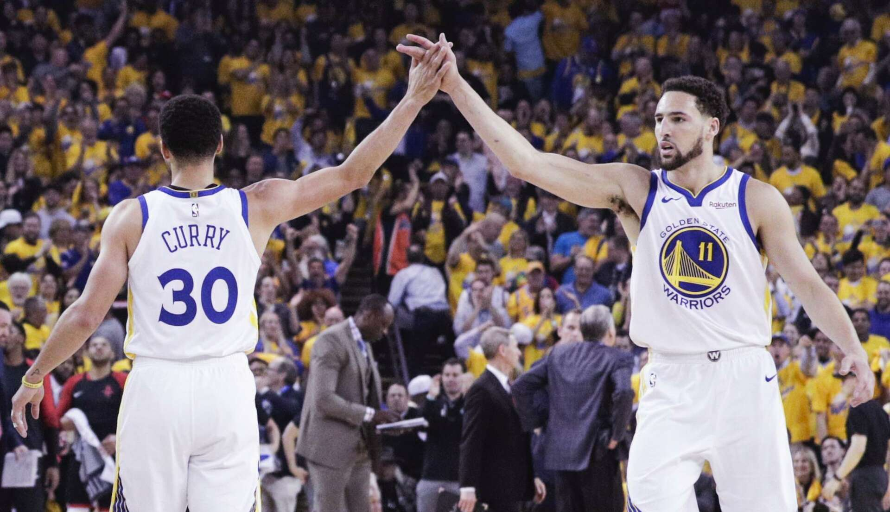

Defining the so-called “hot hand”
---------------------------------

The hot hand is an age-old basketball trope, where it is conventional knowledge that a shooter who has made multiple consecutive shots is more likely to make his next shot, as he is in the zone! It then takes a slew of missed shots to then cool him back down. This thinking is still prevalent in modern-day sports — from a recent article from CBS Sports on an upcoming 2021 playoff match between the Bucks and Celtics, the author writes:

> [Jaylen Brown] is a streaky shooter on the outside…

This phenomenon has been controversial: a [study conducted in 1985](https://www.sciencedirect.com/science/article/pii/0010028585900106?via%3Dihub=) concluded that the hot hand is simply randomness, and that any perceived effect is just flawed human reasoning observing non-existent patterns. This “hot hand fallacy” has then received some pushback, with more recent statistical studies seeming to confirm such an effect.

Intuitively, it seems that factors such as muscle memory, higher confidence, and increased opportunities could support the hot hand effect; on the other hand, defenses certainly adjust and it could even be said that shooters have worse shot choice when they are “on fire”. Does one of these effects dominate, or is the hot hand truly just randomness?

Rather than delve into the entire history of basketball, we limit the scope of our analysis to:

The 2014–2016 Golden State Warriors
-----------------------------------

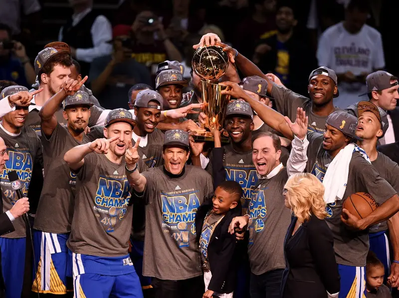

This 2014–16 Warriors squad is notable for many reasons: in the course of these two NBA seasons, the Warriors were lead by the two-time league MVP, sported two of the league’s top four 3-point shooters by percentage (who also broke the record for threes made by a pair of teammates in a season), won their way to a historic 73–9 record, not to mention taking home the 2015 NBA championship.

A large portion of our analysis will be focused on the “Splash Bros” — Stephen Curry and Klay Thompson — widely considered two of the best three-point shooters ever. In general, Klay Thompson is considered the “streakier” shooter; Thompson once dropped 37 points in a single NBA quarter, but has also has had his share of poor shooting stretches. Steph Curry has perhaps been historically more consistent, although both him and Thompson shot well above 40% throughout the 2015 and 2016 season.

Scraping the data
---------------------

We use the ESPN database of previous NBA games from the 2014–2016 NBA seasons, consisting of four databases: the Warrior’s [2015 regular season](https://www.espn.com/nba/team/schedule/_/id/9/season/2015/seasontype/2), [2015 postseason](https://www.espn.com/nba/team/schedule/_/id/9/season/2015), [2016 regular season](https://www.espn.com/nba/team/schedule/_/id/9/season/2016/seasontype/2), and [2016 postseason](https://www.espn.com/nba/team/schedule/_/id/9/season/2016) . From here, we scrape the complete play-by-play data for each game: for each play, we scrape its game time, play details, and the score at the time of the play.

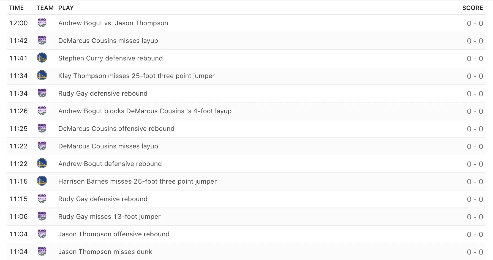

Three Pointers
==============

We begin our analysis on solely three-pointers, our rationale being that three’s are the hardest shot in the NBA; these shots are also most traditionally associated with the hot hand effect.

Let’s first take a look at Steph Curry:

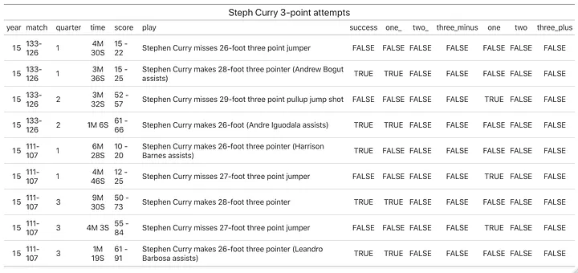

Notably, the ‘one_’, ‘two_’, and ‘three_minus’ columns denote if for that shot attempt, Curry had **missed** his _n_ previous consecutive 3-point attempts that game; likewise, the ‘one’, ‘two’, and ‘three_plus’ columns denote if for that 3-point attempt, Curry had **made** his _n_ previous consecutive 3-point attempts that game. Here’s some of Steph Curry’s 3-point attempts where he had made his previous 3 or more 3-pointers, e.g. when he was on fire!

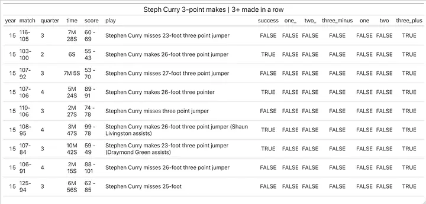

We return to our complete table of Curry’s three point attempts and find conditional 3-point percentages:

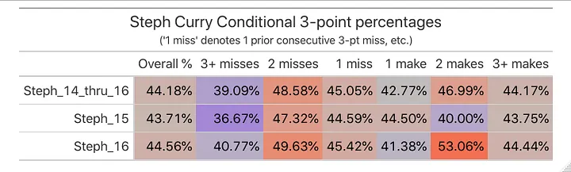

Although there is far from a perfect trend, there seems to be somewhat of an increase in the percentages as we move from more 3-point misses prior to the attempt to more makes. Interestingly, Curry seems to shoot significantly better than his average after missing two of his previous shots, but far worse if it was 3 or more consecutive shots. If we can take away anything, we posit that Curry may exhibit an “extremely-cold-hand” effect, where it takes numerous (>3) misses to affect his shooting significantly.

We now conduct similar analysis on the other Splash Bro, Klay Thompson:

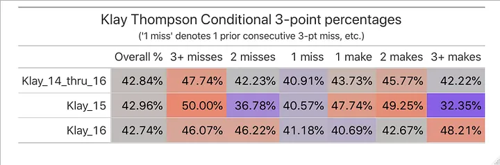

Strikingly, the most obvious trend is Thompson’s significantly higher percentages after he has missed 3 consecutive three’s; then, we notice that his shooting percentage after exactly one miss seems to be lower than average. For Klay, it is hard to conclude that there is any hot-hand effect at all. Rather, one explanation for this pattern could be the perception of “being due” — after missing many shots in a row, shooters often believe they are “due” to make one and get back on track. Although this is a statistical fallacy, it could be this mental impression that increases Thompson’s accuracy for these attempts.

As we are so far without conclusive evidence showing that consecutive 3-point makes increase 3-point shooting percentage, we go into analysis of the details of these three-pointers.

A deeper dive into the threes
---------------------------------

We begin by pulling in other factors from the play details, including:

*   **Distance of the shot attempts**

We might expect “hotter” shooters to feel more confident and thus shoot from deeper; is this confirmed by the data?

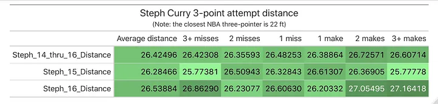
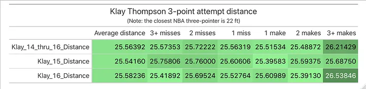

As we would expect, there seems to be an increased average attempt distance for the shots taken after 3+ consecutive makes, for both Curry and Thompson, something that is also fairly consistent throughout both years.

*   **Time between 3-point makes**

Next, we try to see if a shorter time since the last made attempt increases shooting percentage, as there is less time for the shooter to “cool off”. As usual, we begin with Curry:

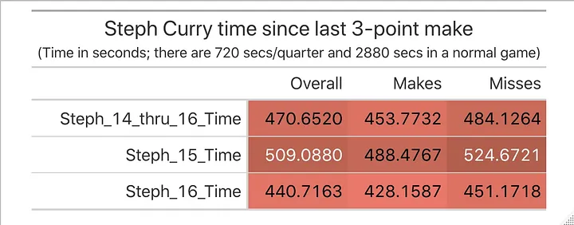

To begin, we see that for any given shot attempt, we would have to go back about 470 seconds (~8 minutes) to find our most recent made 3-pointer; is this longer than what we would have expected? We then clearly see that across all years, successful attempts occur closer to the last make than missed attempts, validating our hypothesis.

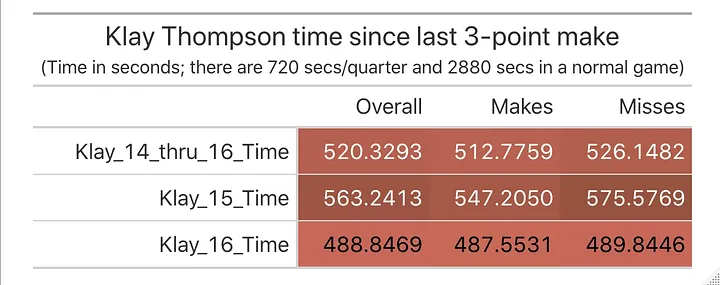

Though Thompson’s attempts are on average further from his most recent make, we find the same trend across both years.

*   **If the three-pointer was assisted**

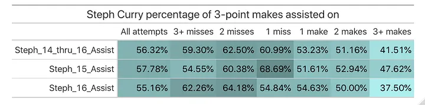

To interpret our data, as an example the top-right cell indicates that out of all Curry’s three-point makes where had made his 3+ prior 3-point attempts, Curry was assisted on 41.51% of those shots.

As we go from 1 to 3+ makes in a row, we notice that the assisted percentage decreases across both years; the story behind this is that as Curry “heats up”, he begins to let it fly more, e.g. a “heat check”. This is also supported by our previous finding that these three’s tend to be further by distance.

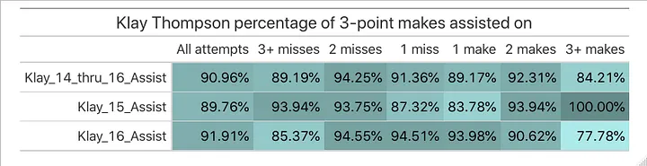

Firstly, Thompson rarely takes un-assisted three pointers! There is a stark difference between Curry ‘s overall ~60% assisted rate, and Thompson’s ~90% rate. Then, we notice the same effect as we observed for Curry only for the 2015 season (83.78% → 93.34% → 100%), but not for the other year. We attribute this to the fact that nearly all of Thompson’s 3-pointers are assisted in the first place.

*   **Distance of previous make**

Finally, we are curious on knowing: for all shots attempted after a successful shot, does _how far_ the previous make was from impact the shooting percentage of the next 3-point attempt?

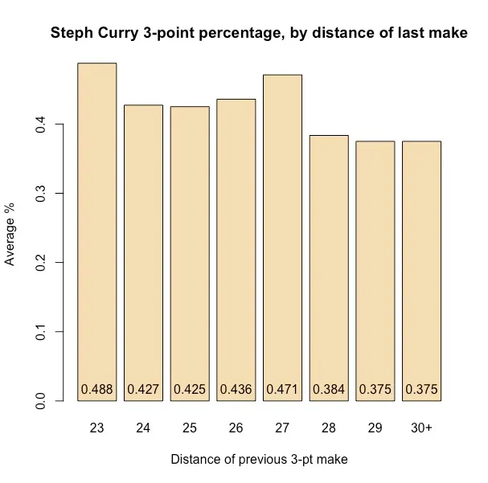
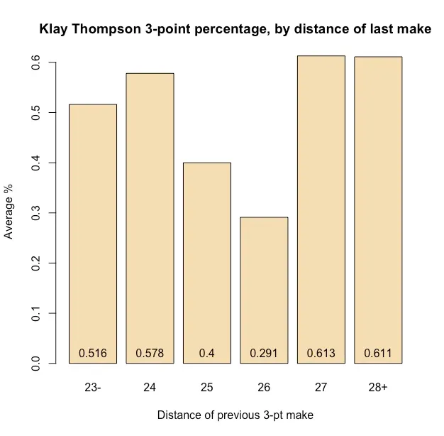

If anything, there is a negative effect for Curry — this could be explained by poor shot choice, where making his previous attempt from deeper could be influencing him to take more difficult shots. There is no strong trend for Thompson’s shooting, but at the very least he seems to shoot the best when his previous makes were further out — a “hot-hand effect” of sorts.

Endogenous effects
------------------

At this point in our analysis we return to the point that the hot-hand effect is almost certainly endogenous, as shooters that make consecutive shots will receive greater attention and be more contested. To address this we study free throws, in which there are no defenders and the shooting process is thus largely “controlled”:

Examining free throws
==================

Using the framework for analyzing three-pointers, we conduct similar analysis on Curry and Thompson:

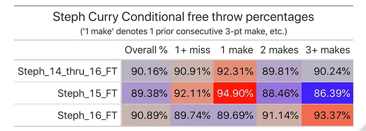
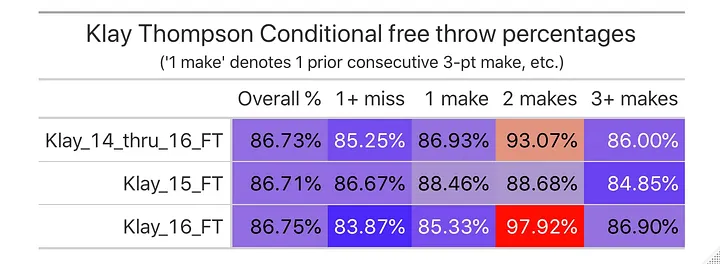

As a preface, we first note that Curry attempted 4.6 free throws per game across these two seasons (compared to 9.6 three-point attempts); likewise, Thompson attempted 3 FT’s/game (7.6 3-point attempts). We naturally have a much smaller sample size for free throws; at the same time, both shooters are “twice” as accurate shooting free-throws, so there is no need for a 2+ or 3+ misses column.

After taking a good look at the data, **we cannot conclude that a free-throw “hot-hand” exists either!** As conventional wisdom suggests, any benefit from “heating up” may only apply for the more difficult shots (e.g. three-pointers); for the Splash Bros who already average ~90% on free throws, which are by nature much easier shots, consecutive makes/misses seem to have a trivial effect on their next attempts.

For fun, we also throw in some analysis of Draymond Green, a historically less accurate free-throw shooter:

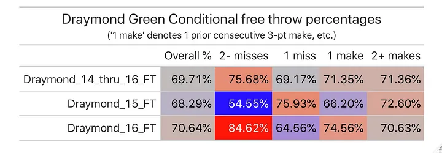

Similarly, there is no concrete increase in percentages as we move from consecutive misses to makes.

Conclusion
----------

As opposed to taking a stance on the whole debate, we took more of a case study approach, analyzing the behavior of two of the greatest shooters of all time. Our initial analysis provided little evidence to conclude that Curry exhibits a “hot-hand” effect; the same could be said for Thompson, although his data does display some forms of streakiness.

We then studied some of the factors that could be strengthening or weakening the hot-hand effect, finding that when Curry and Thompson get hot, they shoot from further; for Curry, he also takes more unassisted threes. These are some possible “weakening” effects of the hot-hand; at the same time, we found that less time after the most recent make is correlated with a higher shooting percentage. All-in-all, these many factors pointing in different directions result in an overall ambiguous net hot-hand effect.

We propose that it whether or not past consecutive makes help shooting percentage could be an **individualized** phenomenon! Curry and Thompson’s drastically different play style resulted in a lot of different patterns in their 3-point data, but were largely similar in their free-throw data (no trends). Thus, a player who is more of a catch-and-shoot guy could feel the hot-hand more than a shot-creator; the hot-hand could also show more strongly with less accurate shooters, which we did not study.

About me
------------

Hi! I’m Frank, a junior at Penn studying business analytics and data science. As you can probably tell, I am a huge sports fan; interestingly, I am from Houston and thus not a huge fan of the Warriors.